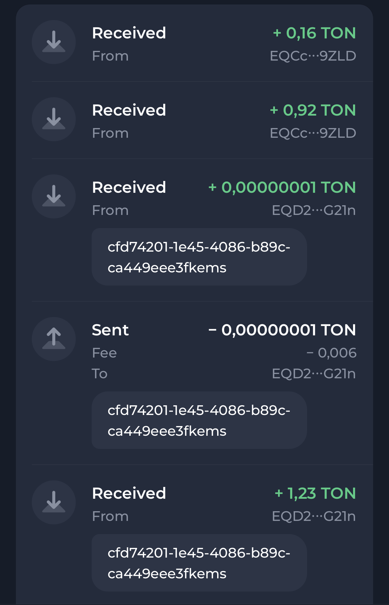

# TonKeeper test assignment

## Demo
https://maxmaxme.github.io/tonkeeper-test-task/

## Description EN
Create a transaction list using the toncenter.com API and address EQD2NmD_lH5f5u1Kj3KfGyTvhZSX0Eg6qp2a5IQUKXxOG21n.

Transactions are loaded automatically when the user scrolls the page. When you click on a transaction, a modal window is displayed in which you can edit the message. The transaction message is written to the browser's local storage. When displaying transactions, you need to use a comment from the local storage (if any), otherwise, the one that was received from the blockchain.

Icons are optional, use the Montserrat font on Google Fonts. The design of the modal window for editing is at your discretion. We are primarily interested in technique, attention to detail and accuracy. Proximity to the layout would be a plus.

## Description RU

  
Open

Сверстать список транзакций в стиле приложения Tonkeeper, используя API toncenter.com и адрес EQD2NmD_lH5f5u1Kj3KfGyTvhZSX0Eg6qp2a5IQUKXxOG21n.

Транзакции подгружаются при скроллинге автоматически. При нажатии на транзакцию показываем модалку, где можно отредактировать сообщение. Сообщение записывается в локальное хранилище. При отображении транзакций используем комментарий из хранилища, если есть, в противном случае — тот, который приехал из блокчейна.

Иконки ставить необязательно, шрифт Montserrat на Google Fonts. Дизайн модалки для редактирования — на свое усмотрение. Нас интересует в первую очередь механика, внимание к деталям и аккуратность. Близость к макету будет плюсом.

## How to run
1. Clone the repository
2. Run `yarn install`
3. Run `yarn start`
